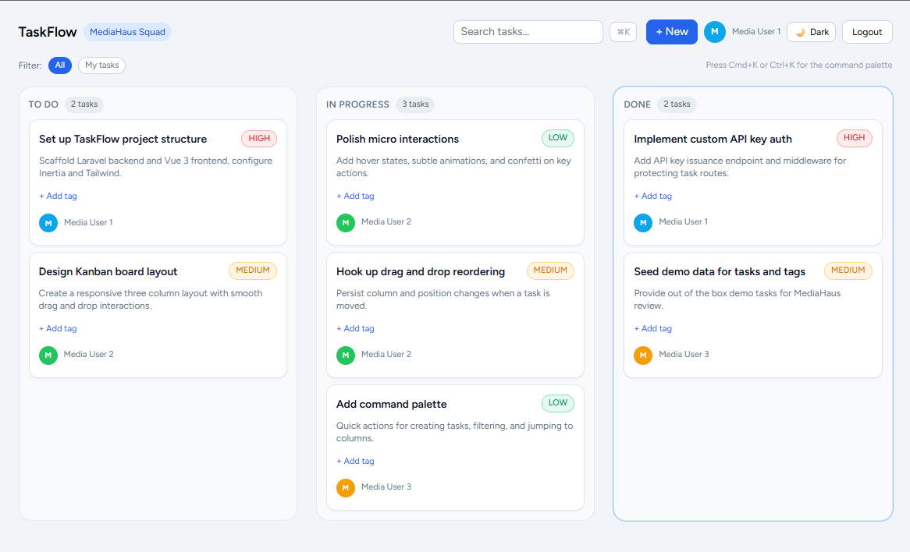

# TaskFlow - Delightful Task Management

## 🎥 Demo Video

[▶ Watch the TaskFlow demo (3 minutes)](https://drive.google.com/file/d/1d3XJuwB2Orjm2B_RL0UKr-7lUnQx2gPu/view?usp=sharing)

## Features
- Kanban board with To Do, In Progress, and Done
- Create, edit, and delete tasks
- Drag and drop between columns
- Inline updates for title, status, assignee, tags, and priority
- Smooth micro-interactions and animations
- Confetti celebration on task completion
- Custom API-key authentication
- Responsive, mobile-first design
- Skeleton loaders for tasks
- Tag creation and deletion with live updates
- Priority badges, dynamic colors, and inline editing

## Tech Stack
- Laravel 11
- Vue 3 + Inertia.js
- Tailwind CSS

## Quick Start
See SETUP.md
